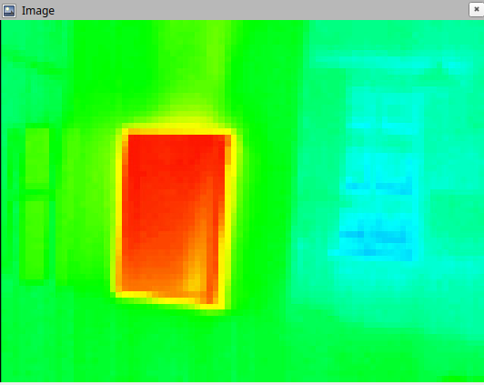

<a href="https://107-systems.org/"></a>
:floppy_disk: `l3xz_openmv_camera`
==================================
[](https://github.com/107-systems/l3xz_openmv_camera/actions/workflows/ros2.yml)
[](https://github.com/107-systems/l3xz_openmv_camera/actions/workflows/spell-check.yml)

ROS driver for [OpenMV Cam H7 R2](https://openmv.io/collections/cams/products/openmv-cam-h7-r2), including support for thermal vision with [FLIR Lepton adapter module](https://openmv.io/collections/cams/products/flir-lepton-adapter-module).

<p align="center">
  <a href="https://github.com/107-systems/l3xz"></a>
</p>

<p align="center">
  
</p>
 
# Setup

#### Target (Robot)
[ROS Galactic Geochelone](https://docs.ros.org/en/foxy/Releases/Release-Galactic-Geochelone.html)

## Prepare camera
1) Connect camera via USB
2) Copy ```camera_script/main.py``` to the USB drive of the camera
3) Unmount camera
4) Reconnect camera

## Additional dependencies

* [openmv](https://github.com/openmv/openmv) as submodule

### How-to-build
```bash
# Clone this repository
git clone https://github.com/107-systems/l3xz_openmv_camera
cd l3xz_openmv_camera
git submodule update --init --progress --depth 1
# Build the package
source /opt/ros/galactic/setup.bash
colcon build
```

### How-to-run
```bash
source install/setup.bash
ros2 run l3xz_openmv_camera l3xz_openmv_camera
```

### Interface Documentation
#### Published Topics
| Default name | Type | Description |
|:-:|:-:|-|
| `/l3xz/openmv/image_color` | [`sensor_msgs/Image`](https://docs.ros.org/en/noetic/api/sensor_msgs/html/msg/Image.html) | Camera image |
| `/l3xz/openmv/image_color_compressed` | [`sensor_msgs/CompressedImage`](https://docs.ros.org/en/noetic/api/sensor_msgs/html/msg/CompressedImage.html) | JPEG compressed image |
| `/l3xz/openmv_camera_info` | [`sensor_msgs/CameraInfo`](https://docs.ros.org/en/noetic/api/sensor_msgs/html/msg/CameraInfo.html) | Camera info |
| `/l3xz/openmv/input_n` | [`std_msgs/Bool`](https://docs.ros.org/en/noetic/api/std_msgs/html/msg/Bool.html) | State of GPIO configured as input |

#### Services
| Default name | Description |
|:-:|:-:|
| `/l3xz/openmv/rgb` | Set binary values to RGB LED |
| `/l3xz/openmv/ir` | Set IR LED |
| `/l3xz/openmv/gpio_config` | Configure GPIO pin |
| `/l3xz/openmv/gpio_set` | Set GPIO pin configured as output |

#### Parameters
| Name | Default | Description |
|:-:|:-:|-|
| `image_topic` | `image_color` | RGB image |
| `image_queue` | 1 | Queue size for RGB image topic |
| `info_topic` | `camera_info` | Camera configuration |
| `info_queue` | 1 | Queue size for camera info topic |
| `show_image` | `false` | Show RGB image in OpenCV window |
| `port` | `/dev/ttyACM0` | Serial port of camera |
| `frames_hz` | 10 | fps |
| `gpio_hz` | 1 | GPIO update rate |
| `frame_id` | `openmv_camera_frame` | camera tf frame |
| `resolution` | `QQVGA` | image resolution |

